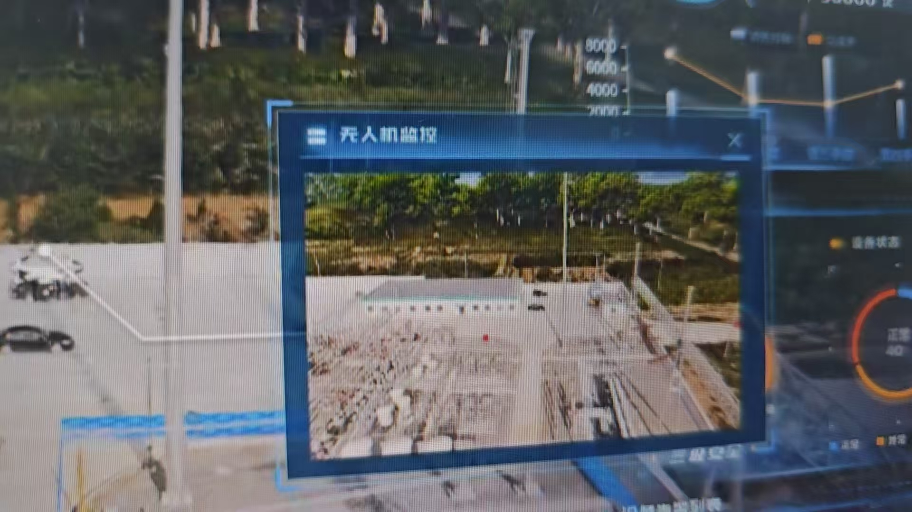
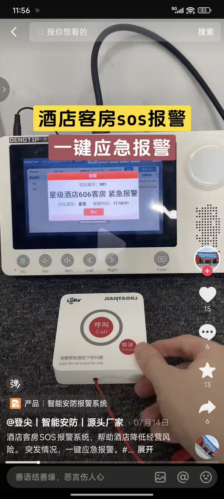
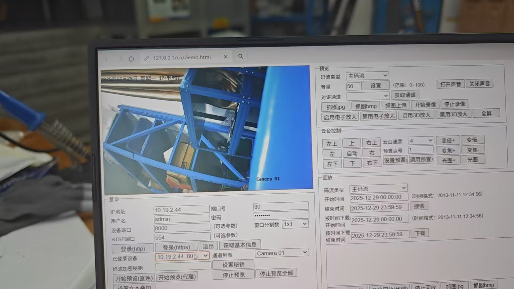

# 智慧管控平台
整个页面展示
[智慧管控平台](./智慧管控平台.png)

## 需求明细
---
API 文档
文档地址：https://www.showdoc.cc/1696319722186207?page_id=9182713536106387
访问密码：xhdoc

监控画面要接入真实的 sdk

模型无所谓，只要是园区东哥你可以随便选，啥都可以，不过要好看
2500 可以不

模型帮忙加个无人机视角，类似这样的

东哥，还需要一个报警,就是把一个按钮放在小角落按下去也可以跳出来这个界面,当然也是假的

就监控画面，安防系统，LED 大屏，环境检测四个标签页

海康监控画面

就是那些没用的标签页东哥看看能不能放点模型互动或者啥表演性强的玩意

无人机视角能不能和监控一样可以点开放大
