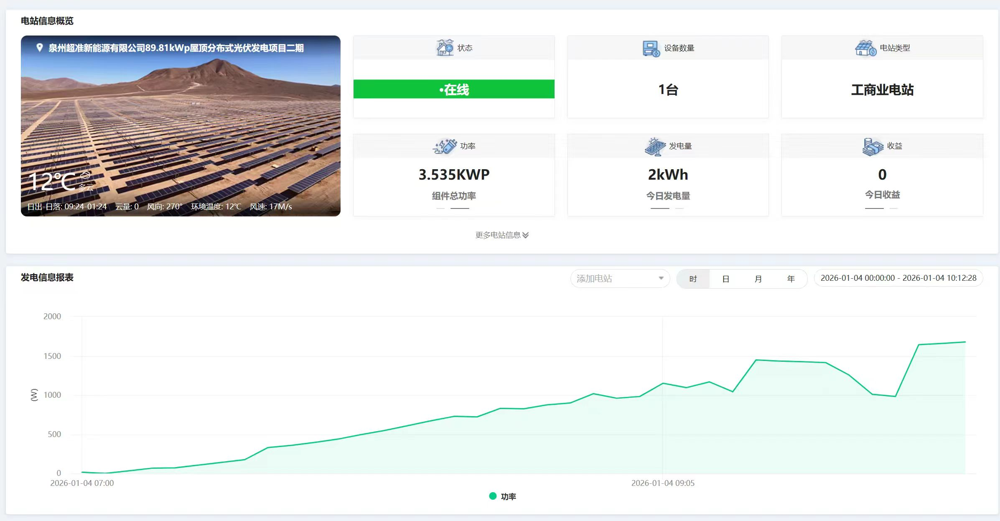
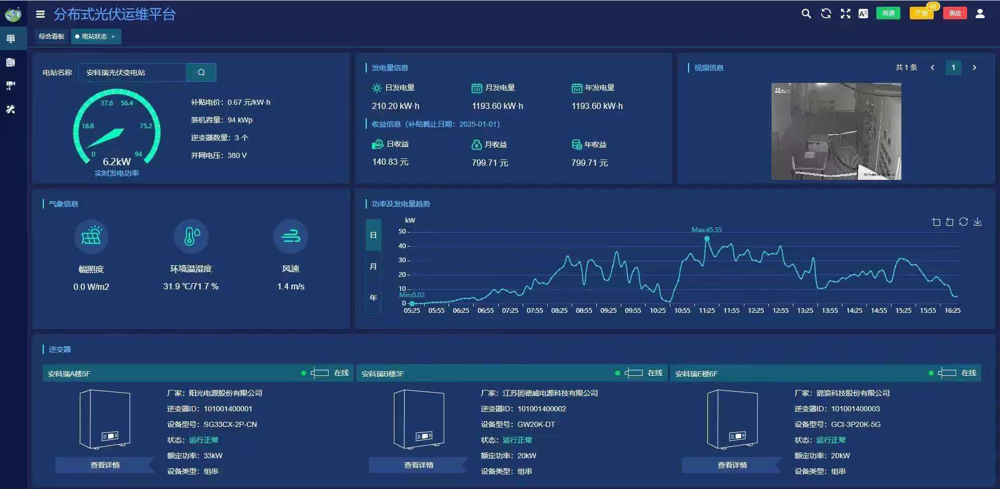
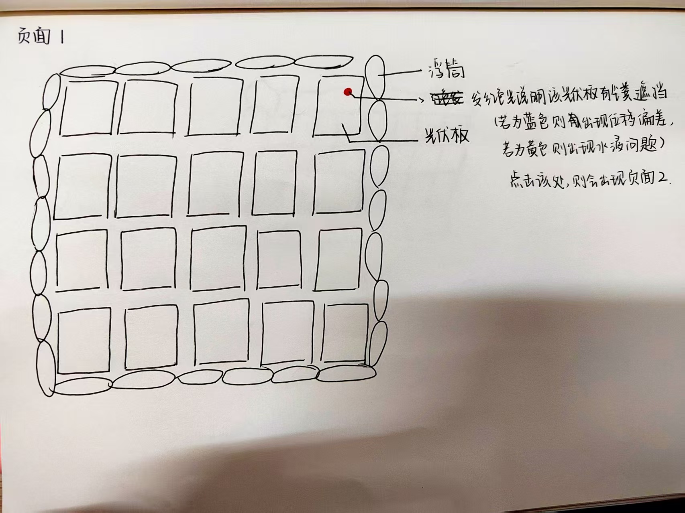
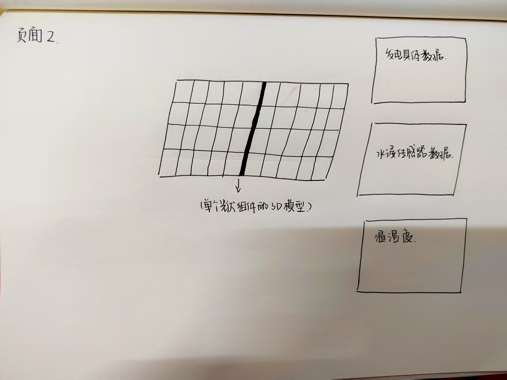

项目模版用这个的antd-vue，颜值高，容易跑
https://github.com/soybeanjs/soybean-admin

项目模板目录为soybean-admin
没有数据，数据填这个的

不是，只是数据内容，模板要这个的
就是麻烦东哥两个都帮忙脱敏处理一下，比赛要求不能有地名厂家名称学校名称人民或标志

这个是太阳能板的两个平台,模型格式是sw,只需要前端

太阳能板就是哪一块板子出问题就出现和其他板块不一样的颜色，然后点进去有报错

总共是做三个页面，其中一个是跟之前发给你的图片一样，是发电的实时数据，包括那个曲线图，那个页面的功能就跟之前发的图片上面差不多，之前有说过了

要求页面1

要求页面2

还有两个页面的话，就是放在另一个屏幕，跟我之前发给你的图片差不多，先是页面一有一个整个光伏系统的模型，哪一个出了问题，出了什么问题？会出现不同颜色的亮斑，点到那个亮斑里面就会出现页面二，然后页面二是对单独一块板的数据分析